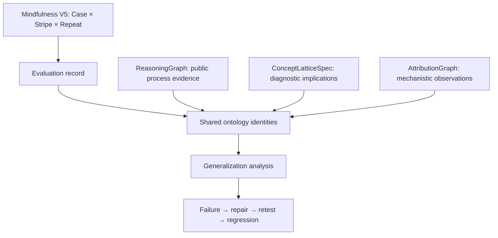

# Reasoning ontology

`rg-ontology-v1` connects the repository's specialized graph views through stable identities.
It represents public claims, evidence, operations, transformations, evaluations, failures,
repairs, and mechanistic observations. Existing graph schemas and scoring remain independent.
The ontology adds no reward, network access, automatic inference, or external action.

The three version dimensions are independent:

| Dimension | Version |
| --- | --- |
| Behavioral identity | `17case-v5`, from `rg_tracer.epistemic_cases` |
| Shared ontology | `rg-ontology-v1` |
| DSPy research overlays | V3 |



## Registry and identity

`src/rg_tracer/ontology/registry.json` is the machine-readable vocabulary.
`load_registry()` returns a fresh copy with expanded relation signatures. `EntityType`,
`RelationType`, `EpistemicStatus`, and `GraphView` derive from this resource.
The registry includes the direction, inverse, symmetry, transitivity, and per-view cycle
policy for each relation. These fields describe the asserted relation; the library does
not compute inverse edges, transitive closure, or new facts.

Registered entity types:

```text
TASK OBJECTIVE CONSTRAINT ASSUMPTION CLAIM EVIDENCE CONCEPT REASONING_UNIT STEP
TRANSFORMATION REPRESENTATION ACTION TOOL_ACTION ARTIFACT OBSERVATION OUTCOME
VERIFICATION EVALUATION_RECORD CANONICAL_CASE ROBUSTNESS_STRIPE STRIPE_SUBTYPE REPEAT
FAILURE FAILURE_FAMILY REPAIR REGRESSION_TEST MODEL MODEL_FEATURE CIRCUIT_FEATURE
ACTIVATION_PATTERN ATTRIBUTION_EDGE ATTRIBUTION_PATH CONCEPT_PROBE
MECHANISTIC_OBSERVATION RUN DATASET_EXAMPLE
```

`STEP` represents a reasoning step in execution history. Semantic reasoning operations
use `REASONING_UNIT`. Lattice attributes use `CONCEPT` entities with the original attribute
description retained as a property; there is no competing attribute vocabulary.

`OntologyEntity(id, type, canonical_name, aliases=(), metadata={}, provenance=())` rejects
empty IDs, unknown types, and empty names. Records are frozen; nested JSON metadata receives
a defensive immutable copy. Within one graph, an existing ID cannot acquire a different
name or payload. Callers choose IDs for local objects. Adapter IDs remain scoped to their
source graph, so node `f` from two different models is not automatically the same feature.
Do not combine such nodes under one ID; assign explicit run/model-scoped IDs before merging.

## Four graph views

| `GraphView` value | Purpose | Cycle rule |
| --- | --- | --- |
| `semantic` | Claims, concepts, constraints, transformations | Cycles permitted |
| `execution` | Observed execution and provenance lineage | Directed acyclic graph required |
| `evaluation` | V5 coordinates, failures, repairs, regression tests | Cycles permitted |
| `mechanistic` | Features, attribution, concept probes, mapping evidence | Cycles permitted |

`OntologyGraph(view)` accepts shared entities from other views, but every edge must match
its view's registered source and target types. `add_relation()` rejects unknown relations,
missing endpoints, incompatible types, and execution cycles before appending the edge.
The read-only `entities` mapping and `relations` tuple expose the stored records.
`validate()` checks references and strong claim statuses. `to_dict()` validates before
returning JSON-compatible data with the ontology version.

`DERIVED_FROM` points from derivative to source. Execution DAG validation reverses that
edge to compare all execution edges in source-before-result order. Thus `a PRECEDES b`
and `b DERIVED_FROM a` describe consistent lineage. `b PRECEDES a` would introduce a cycle.
Semantic `DEPENDS_ON` and semantic `DERIVED_FROM` never enter execution DAG validation.

## Relation vocabulary

The registry is authoritative for permitted signatures; this grouping aids discovery.

| Purpose | Relations |
| --- | --- |
| Identity and abstraction | `INSTANCE_OF`, `SPECIALIZES`, `GENERALIZES`, `EQUIVALENT_TO`, `PARAPHRASE_OF`, `REPRESENTATION_OF` |
| Task context | `HAS_OBJECTIVE`, `REQUIRES`, `CONSTRAINED_BY` |
| Epistemic assertions | `SUPPORTS`, `CONTRADICTS`, `ENTAILS`, `DEPENDS_ON`, `DERIVED_FROM` |
| Execution and verification | `CONTAINS`, `PRODUCES`, `PROVIDES`, `PRECEDES`, `VERIFIED_BY`, `VERIFIES` |
| Reasoning and transformation | `OPERATES_ON`, `TRANSFORMS`, `TRANSFORMS_TO`, `PRESERVES`, `CHANGES`, `BREAKS_INVARIANT`, `USES`, `COMPOSES_WITH`, `GENERALIZES_TO` |
| Mechanistic and cross-view association | `ASSOCIATED_WITH`, `CANDIDATE_ENCODING_OF`, `PREDICTIVE_OF`, `CAUSALLY_CONTRIBUTES_TO`, `CONTRIBUTES_TO`, `ATTRIBUTED_TO`, `HAS_FEATURE`, `ACTIVATED_IN`, `ACTIVATED_DURING`, `TESTS`, `SUPPORTS_MAPPING` |
| Evaluation and repair | `HAS_CASE`, `HAS_STRIPE`, `HAS_SUBTYPE`, `HAS_REPEAT`, `OBSERVED_IN`, `TRIGGERED_BY`, `FAILS_UNDER`, `FAILS_WITH`, `REPAIRED_BY`, `REGRESSION_OF` |

Direction examples: evidence `SUPPORTS` claim; claim `CONSTRAINED_BY` constraint;
transformation `PRESERVES` concept; failure `OBSERVED_IN` evaluation;
repair `VERIFIED_BY` evaluation; regression test `VERIFIES` repair.
`TRANSFORMS` links the operation to its input representation; `TRANSFORMS_TO` links
the input and output representations. The `Transformation` record carries both endpoints.
`CONTRIBUTES_TO` means a reported attribution contribution; only
`CAUSALLY_CONTRIBUTES_TO` asserts a tested causal contribution.

The accepted spelling aliases are `INSTANCE_OF_FAILURE` → `INSTANCE_OF`,
`EXPRESSES` → `REPRESENTATION_OF`, and `QUALIFIED_BY` → `CONSTRAINED_BY`.
They serialize using the canonical relation name. There is no `PROVES` or feature-`IS`-concept
relation. `EQUIVALENT_TO` allows only matching semantic entity types, never a feature and concept.

## Claims, provenance, and conflicting evidence

Use `Claim` to construct `CLAIM` entities. Claims support optional subject/predicate/object
triples and an unrestricted JSON `content` representation. They also retain scoped
`constraints`, optional `semantic_key`, confidence plus its source, evidence IDs,
verification IDs, and status history.

Claims default to `INFERRED`. The status vocabulary is:

```text
OBSERVED INFERRED PROVISIONAL VERIFIED ESTABLISHED
CONTRADICTED QUARANTINED SUPERSEDED REOPENED
```

`Provenance` requires a non-empty `source`. Optional fields are `source_span`, `run_id`,
`step_id`, `created_by`, `observation_time`, `transformation`, `verification`, and `version`.
Unknown optional values remain `None`; adapters do not invent timestamps or run IDs.
Claims, evidence, artifacts, observations, evaluation records, mechanistic observations,
verifications, failures, repairs, and regression tests require at least one provenance record.
Adapter provenance identifies the supplied source object; it does not certify source truth.

`graph.record_evidence(claim_id, evidence_id, contradicts=False)` accepts task-level `EVIDENCE`.
Contradiction appends the evidence, retains support and provenance, records the earlier status,
and changes status to `CONTRADICTED`. Adding support does not silently promote a claim.
Direct `add_relation()` calls and adapter-created evidence edges follow the same bookkeeping.
A `Claim CONTRADICTS Claim` assertion marks both claims as disputed without counting either
claim as task-level evidence. A contradiction added after verification retains the verification
record and earlier status while changing the current status to `CONTRADICTED`. Promotion and
export also inspect contradiction edges independently of the claim's cached evidence fields.

`graph.promote_claim(claim_id, verification_id, established=False)` requires supporting
task evidence and a `VERIFICATION` entity whose metadata contains:

```python
{"method": "task_verification", "result": "passed", "claim_id": "the-claim-id"}
```

Promotion records `VERIFIED`, or `ESTABLISHED` when the caller explicitly sets
`established=True`. Unresolved contradictory evidence prevents promotion. Represent a
revised claim separately and link its history. Directly constructed strong statuses still
undergo the same reference and evidence checks in `validate()` and `to_dict()`.
The library checks the verifier record, not the verifier's empirical reliability.

## Conservative canonicalization

`candidate_equivalences(claims)` proposes pairs only when the caller supplied the same
non-empty `semantic_key` and exactly equal scoped constraints. Similar words alone do
not produce candidates. Paraphrases such as “parity remains unchanged” and “parity is
preserved” can share the explicit key `parity_invariance`; the key expresses a hypothesis.

`canonicalize_claims(claims, canonical_id, verification)` additionally requires a passed
`VERIFICATION` record with `method="semantic_equivalence"` and `observation_ids` naming
exactly the observations being grouped. It rejects different constraints, missing semantic
keys, and repeated observation IDs. The returned `CanonicalIdentity` retains each complete
claim, provenance record, evidence list, and epistemic status. It groups semantic identity
without erasing disagreements or making any claim more authoritative.
Direct `CanonicalIdentity` construction uses the same validation as `canonicalize_claims`
and copies the supplied observation sequence to an immutable tuple.

Include authorization, intent, domain, units, scope, and other relevant conditions in
`constraints`. An authorized action and an unauthorized action with similar surface
operations cannot canonicalize when those conditions differ. The library cannot discover
an omitted condition; semantic-key assignment and equivalence verification remain explicit
research/evaluation responsibilities.

## Transformations and generalization

`Transformation` is a first-class entity with `inputs`, `outputs`, `preserved_properties`,
`changed_properties`, `expected_invariants`, `observed_invariants`, `symmetry_breaks`,
`inverse`, and `composition_parent`. These fields record observations and proposed lineage;
they do not prove invertibility or invariant preservation.

Registered kinds are `Paraphrase`, `Translation`, `CodeRefactor`, `VariableRename`,
`RepresentationChange`, `Abstraction`, `Instantiation`, `Compression`, `Expansion`,
`SemanticLaundering`, `ToolSubstitution`, and `PromptReframing`.
`adapt_transformation()` accepts a mapping containing these fields and retains the full
group-theoretic overlay in `metadata.source_payload`. No existing group-overlay rule changes.
Link evaluations through `Failure TRIGGERED_BY Transformation` and use `PRESERVES` or
`BREAKS_INVARIANT` to record the property under test.

The registry records generalization levels from instance memorization through local,
concept, and compositional transfer to cross-domain abstraction. It also names
under-generalization, overgeneralization, wrong abstraction, false equivalence, concept
collapse, and representation dependence. These labels can annotate evaluations or failure
families; no classifier or score for these labels is implemented. Higher abstraction receives
no intrinsic preference. Synthetic dataset targets and transformation lineage can be stored
on `DATASET_EXAMPLE` metadata and linked to source entities.

## Existing-system adapters

Import graph adapters from `rg_tracer.ontology.adapters`. Each graph adapter returns an
`AdapterResult(graph, unmapped)`. `source_payload` is a defensive JSON-compatible snapshot
of the supplied schema payload, including unsupported edges and extra metadata. Dataclass
tuples normalize to JSON arrays. Adapters do not modify the supplied object. Unknown or
type-incompatible relations appear in `unmapped` rather than acquiring invented semantics.

| Adapter | Result and preserved information |
| --- | --- |
| `adapt_reasoning_graph(graph, source_ref=...)` | Maps known node kinds to claims, reasoning units, actions, concepts, evidence, assumptions, or constraints. Unknown kinds remain representations. Preserves `task_id`, `answer_ref`, node IDs, original relations, weights, text, and metadata. Generated claims start inferred; contradiction edges mark disputed claims. |
| `adapt_concept_lattice(spec, source_ref=...)` | Represents attributes as concepts and valid implications as `ENTAILS`. Preserves domain, descriptions, and `shadow_only`. Implications remain provisional diagnostic assertions. |
| `adapt_attribution_graph(graph, source_ref=...)` | Maps nodes to model/circuit features and edges to reported `CONTRIBUTES_TO` or `ATTRIBUTED_TO`. Preserves model, task, layer, activation, signed attribution, token positions, phase, and input mapping extras. Causal-looking source relations remain unmapped. |
| `adapt_semantic_tag(tag)` | Uses the existing `SemanticTag` identity. Error tags become failure families; `SUPPORTED` and `ENTAILED` remain validation concepts. Unknown tags fail. |
| `adapt_reasoning_units()` | Reads the existing registry, creates family concepts and reasoning-unit entities, and links known dependencies/composition partners. Unregistered partner references are reported without inventing families. |
| `adapt_transformation(payload, identifier, provenance)` | Retains transformation properties and the complete supplied group-overlay payload. Returns a `Transformation` entity. |

## V5, failure, repair, and regression

Import `adapt_evaluation` and `add_failure_repair` from `rg_tracer.ontology.evaluation`.
`adapt_evaluation(record, evaluation_id, provenance)` accepts a case result or a mapping
with `case_id`, `stripe`, `stripe_subtype`, and `repeat_id`. Defaults are `NONE`, `None`,
and `0` for the last three fields. Validation uses the shared pinned contract.
When a source supplies version, canonical identity, provenance, or case-name fields, the
adapter rejects values inconsistent with the pinned contract. Legacy records may omit
these fields; the adapter retains the original payload and resolves current V5 identity.

Canonical case IDs are `17case-v5:case:<id>`. Stripe and subtype identities use the same
external namespace, with subtype IDs scoped to their stripe. Titles and meanings come from
the shared registry. The evaluation keeps the source payload and contract hashes/commit;
edges expose case, stripe, subtype, and repeat separately. Direct case/stripe entity
construction also checks identity against that contract. Coordinate edges reject mismatches.

Case 0 remains an evaluation with `canonical=False`; it has no `CANONICAL_CASE` entity and
no `HAS_CASE` edge. It still carries operational stripe/repeat metadata.

`add_failure_repair(graph, failure, failed_evaluation_id, repair,
verification_evaluation_id, regression)` appends:

```text
Failure OBSERVED_IN failed evaluation
Failure REPAIRED_BY Repair
Repair VERIFIED_BY retest evaluation
RegressionTest REGRESSION_OF Failure
RegressionTest VERIFIES Repair
retest evaluation PRODUCES RegressionTest
```

This helper validates the entire addition before changing the graph. It preserves the
original failure. Here `VERIFIED_BY` identifies the checking evaluation, including a failed
retest; read the evaluation's result before concluding that a repair succeeded. Use
`INSTANCE_OF` to connect semantic-tag failure families, and `ASSOCIATED_WITH` to connect
failures or repairs to concepts. A graph stores reported evidence; it does not execute repairs.

## Mechanistic boundary and non-claims

`MECHANISTIC_OBSERVATION SUPPORTS_MAPPING CONCEPT` concerns a candidate internal mapping.
The domain of semantic `SUPPORTS` excludes mechanistic observations. Features and concepts
remain different entity types. A causal edge requires an evidence reference to a
`VERIFICATION` with a passed `intervention` or `causal_test` method and matching `source_id`
and `target_id`. Correlation, activation, task success, or a test concerning different endpoints
cannot satisfy this check. A task verification cannot establish a mechanistic mapping.

The ontology does not prove that:

- An attribution feature is a human-interpretable concept.
- A public reasoning trace faithfully represents hidden model computation.
- A diagnostic concept lattice reflects the model's internal ontology.
- Semantic equivalence implies mechanistic equivalence, or the reverse.
- Correlation between a circuit and behavior establishes causation.
- A verified task outcome proves use of the intended reasoning process.

These remain empirical questions. Automatic semantic discovery, a graph query engine,
cross-run feature identity resolution, causal experiment execution, and verifier reliability
assessment are future work, not implemented capabilities.

## Verification

From `reasoning-generalization-tracer`, run:

```sh
PYTHONPATH=src python -m pytest tests/test_ontology.py tests/test_ontology_adapters.py -q
```

The tests cover registry semantics, immutable identities, provenance, semantic cycles,
mixed execution edge directions, contradictory evidence, direct strong-status validation,
endpoint-bound causal tests, conservative equivalence, scoped authorization, adapter
metadata, canonical V5 identities, Case 0, transformation lineage, and atomic repair history.
Existing reasoning, lattice, attribution, and semantic tests verify compatibility separately.
